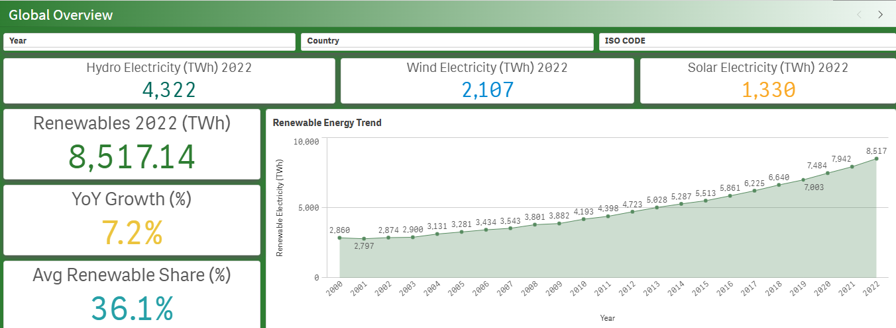
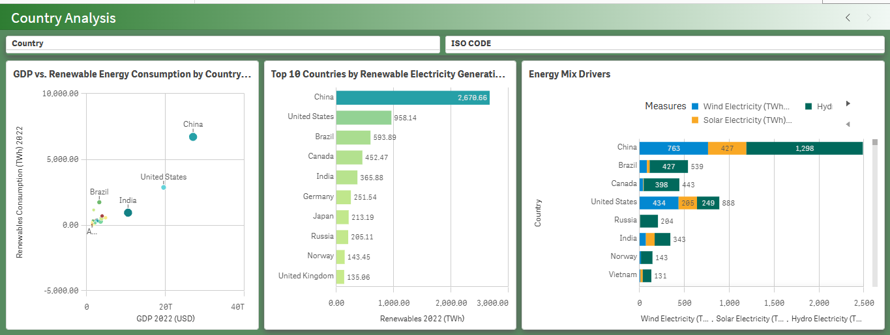

# Global Renewable Energy Trends Dashboard

Interactive renewable energy analysis covering 2000–2022
built using Python and Qlik Sense

## Dashboard Preview

### Global Overview

### Country Analysis

## Project Overview
This project analyses global renewable energy trends from 2000 to 2022,
exploring how countries have grown their renewable electricity capacity
over time. The goal was to identify leading nations, track year-on-year
growth, and understand the energy mix driving the global transition to
renewables. Data was cleaned using Python and visualised in Qlik Sense.

## Data Source
- **Dataset:** Our World in Data — Energy Dataset
- **Source:** https://ourworldindata.org/energy
- **File:** owid-energy-data.csv
- **Period:** 2000 – 2022
- **Description:** This dataset contains country-level energy data
  including renewable electricity generation, solar, wind, hydro,
  GDP, population, and renewable share metrics across all major economies.

## Tools
- **Python (Jupyter Notebook)** — Data cleaning and exploratory data analysis
- **Qlik Sense** — Interactive dashboard and visualisation

## Data Cleaning (Python)
- Loaded raw CSV and inspected shape, nulls and data types
- Selected relevant renewable energy columns including country, year,
  ISO code, population, GDP, renewables electricity, solar, wind,
  hydro, and renewable share fields
- Dropped rows where renewable electricity share was missing
- Filtered dataset to years from 2000 onwards
- Exported cleaned dataset for loading into Qlik Sense

## Dashboard Sheets

### 1. Global Overview
- **Renewables 2022** — 8,517.14 TWh total global renewable electricity
- **YoY Growth** — 7.2% year-on-year growth in renewable electricity
- **Avg Renewable Share** — 36.1% average share of renewables in energy mix
- **Hydro Electricity 2022** — 4,322 TWh
- **Wind Electricity 2022** — 2,107 TWh
- **Solar Electricity 2022** — 1,330 TWh
- **Renewable Energy Trend** — line chart showing steady growth from
  2.86k TWh in 2000 to 8.52k TWh in 2022

### 2. Country Analysis
- **GDP vs Renewable Energy Consumption** — scatter plot comparing
  economic size against renewable output per country
- **Top 10 Countries by Renewable Electricity** — China leads at
  2,678.66 TWh followed by the United States at 958.14 TWh
- **Energy Mix Drivers** — stacked bar chart breaking down wind,
  solar and hydro contributions per country

## Results
- Global renewable electricity grew from 2,860 TWh in 2000 to
  8,520 TWh in 2022 — nearly tripling over 22 years
- China is the world's largest renewable energy producer at 2,678 TWh,
  driven primarily by hydro (1,298 TWh) and wind (763 TWh)
- Solar electricity grew the fastest, becoming a significant contributor
  from 2012 onwards
- Average global renewable share reached 36.1% by 2022
- Norway and Brazil stand out as high renewable share economies
  relative to their GDP

## Recommendations
- Countries with high GDP but low renewable share like Russia should
  prioritise investment in wind and solar infrastructure
- Solar presents the highest growth opportunity globally given its
  rapid trajectory from 2012 to 2022
- Smaller economies can benchmark against Norway and Brazil who
  achieve high renewable shares without the scale of China or the US
